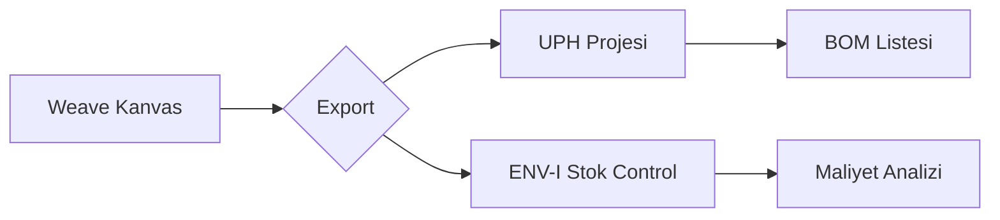

# 🎨 T-Weave: Akıllı Şematik Tasarım Motoru


> **"Donanım tasarımlarınızı canlandıran etkileşimli kanvas motoru."**

[](https://github.com/alazndy/Weave)
[](https://github.com/alazndy/Weave)
[](https://nextjs.org)
[](https://tailwindcss.com)

**T-Weave**, donanım bileşenlerini ve aralarındaki bağlantıları görselleştirmek, organize etmek ve yönetmek için tasarlanmış güçlü bir etkileşimli tasarım motorudur. Karmaşık sistem mimarilerini basitleştirerek, mühendislik süreçlerini hızlandırır.

---

## ✨ Öne Çıkan Özellikler

### 🕸️ Etkileşimli Kanvas

- **Sürükle-Bırak Arayüzü**: Bileşenleri serbestçe yerleştirin ve düzenleyin.
- **Akıllı Bağlantılar**: Modüller arası otomatik rota belirleme ve bağlantı yönetimi.
- **Dinamik Önizleme**: Tasarımlarınızın anlık görsel çıktılarını alın.

### 🔌 Ekosistem Entegrasyonu (UPH & ENV-I)

T-Weave, **TEK Ekosistemi**'nin kalbinde yer alır:

- **📤 UPH'a Aktarım**: Tasarımları doğrudan [T-HUB (UPH)](https://github.com/alazndy/UPH) projesine aktarın.
- **📋 Otomatik BOM**: Tasarımdaki bileşenlerden otomatik malzeme listesi (BOM) oluşturma.
- **📦 Envanter Senkronizasyonu**: ENV-I üzerinden stok durumunu anlık kontrol etme.
- **🖼️ Görsel Küçük Resimler**: Proje detaylarında görünmek üzere otomatik tasarım önizlemeleri oluşturur.

### 🛠️ Modüler mimari

- **Genişletilebilir Kütüphane**: Farklı mühendislik alanları için özelleştirilebilir bileşen seti.
- **Vektörel Çizim**: SVG tabanlı yüksek kaliteli render performansı.
- **Global State**: Zustand ile senkronize edilmiş karmaşık kanvas durumu.

---

## 🛠️ Teknoloji Yığını

| Alan | Teknoloji | Açıklama |
|:-----|:----------|:---------|
| **Frontend** | [Next.js 15](https://nextjs.org/) | Modern App Router mimarisi |
| **Kanvas** | Custom SVG/Canvas | React ile optimize edilmiş çizim motoru |
| **İkonlar** | [Lucide React](https://lucide.dev/) | Temiz ve tutarlı ikon seti |
| **State** | [Zustand](https://github.com/pmndrs/zustand) | Kanvas ve UI state yönetimi |
| **Entegrasyon** | Firebase/Storage | Tasarım ve görüntü depolama |

---

## 🚀 Başlangıç

### 1. Klonlama & Kurulum

```bash
git clone https://github.com/alazndy/Weave.git
cd Weave-main
pnpm install
```

### 2. Geliştirme Sunucusunu Çalıştırma

```bash
pnpm dev
# Uygulama http://localhost:3000 adresinde çalışacak
```

---

## 🔄 Veri Akışı



---

## 🆕 Son Güncellemeler

### v2.0.0 (2025-01-20)

- ✨ Ecosystem Switcher entegrasyonu
- ✨ Gelişmiş export modal ve UPH senkronizasyonu
- ✨ Modüler state yönetimi (slices)
- ✨ Yeni tasarım sistemi ve UI iyileştirmeleri

---

## 🤝 Katkıda Bulunma

Lütfen depoyu fork'layın ve Pull Request gönderin.

---

## 📄 Lisans

Bu proje MIT Lisansı altında lisanslanmıştır.

---

## 🔗 Bağlantılar

- **T-HUB (UPH)**: Proje yönetim sistemi
- **ENV-I**: Envanter yönetim sistemi
- **Dokümantasyon**: [Wiki](./docs)
- **Hata Bildirimi**: [GitHub Issues](./issues)

---

*ADC Tasarım Danışmanlık Ekosistemi'nin bir parçasıdır.*
